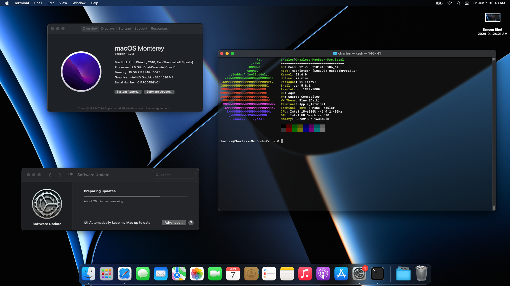
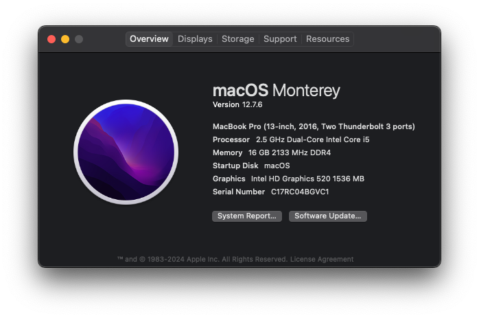
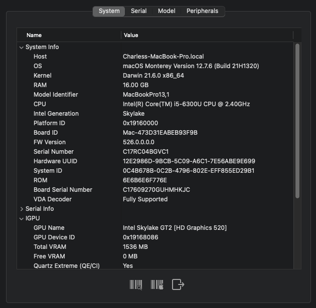

# OpenCore Dell Latitude 7480 Hackintosh EFI

## MacOS Version

-  Monterey 12.0 - 12.7.6 (Current)

*  May work with Big Sur and Ventura, I haven't tested yet. Happy with Monterey.

## My Specs

|                    |                                      |
| ------------------ | ------------------------------------ |
| **Model**          | Dell Latitude 7480                   |
| **Processor**      | Intel Core i5-6300U 2.4GHz (Skylake) |
| **Graphics**       | Intel HD Graphics 520                |
| **Memory**         | 16GB 2133MHz DDR4                    |
| **Display**        | 13" 1920x1080 (Not Touchscreen)      |
| **Storage**        | Micron 256GB M.2 NVMe                |
| **Wireless**       | Intel Wireless 8265/8275 (WiFi+BT)   |
| **Camera**         | Integrated Webcam HD 1920x1080       |
| **Audio**          | Realtek ALC3246                      |
| **Trackpad**       | I2C HID ALPS                         |
| **microSD Reader** | Built-In SDXC Reader                 |

## Working Features

-  [x] Graphics acceleration
-  [x] All USB/USB-C ports
-  [x] HDMI/USB-C display output
-  [x] Webcam
-  [x] 2.5GHz WiFi
-  [x] 5GHz WiFi
-  [x] Bluetooth
-  [x] Shutdown/Reboot/Sleep/Wake
-  [x] Speakers
-  [x] Headphone/Headset/Mic Jack ([ComboJack](https://github.com/hackintosh-stuff/ComboJack) req'd)
-  [x] Intel Gigabit Ethernet
-  [x] App Store
-  [x] iMessage
-  [x] FaceTime
-  [x] AppleID
-  [x] iCloud+
-  [x] iCloud Photo Sync
-  [x] macOS Updates
-  [x] Keyboard (sometimes feels a bit laggy)
-  [x] Fn keys
-  [x] Trackpad with multitouch gestures (a bit slow to respond at times)
-  [x] microSD Card Reader
-  [ ] Airdrop, Handoff, Airplay

## ToDo

-  [ ] Replace Intel WiFi with Broadcom BCM94360
